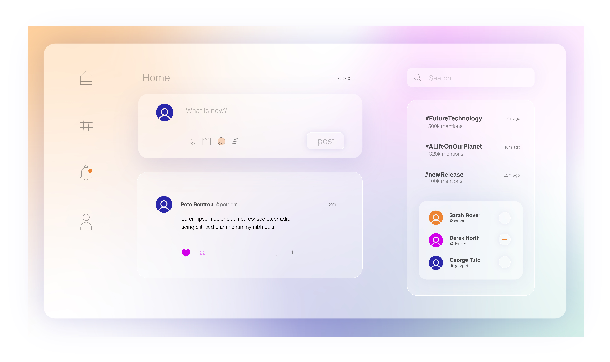

# TwitterCloneAPI

** Version 1.0.0

Application, similar to Twitter by user being able to post, follow and see new trends of future technology

## Databases
There are two types of databases used with PHP - MySQL *(relational database)* and ArangoDB *(multi-model)*

### Licence and copyright
© Zuzana Korinkova
